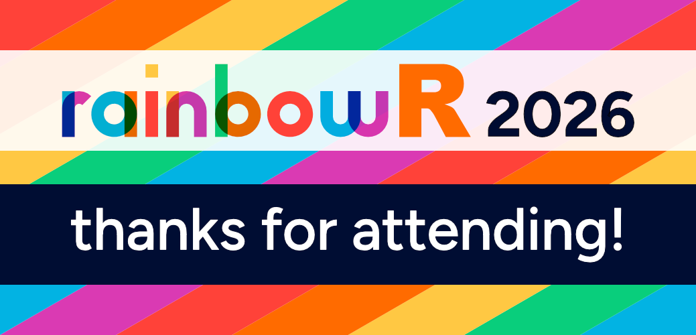

{fig-alt="Thank you for attending the rainbowR conference"}

<!-- [ Closing remarks](https://youtu.be/VIDEO_ID){.btn .icon-link} -->

# What next?

We hope you enjoyed the rainbowR conference!

If you'd like to stay involved with the rainbowR community, here are some things you can do next:

## Everyone

- Keep participating in the conference Discord server.
- Follow and engage with rainbowR on social media.
- Tell others about us.
- Visit <https://rainbowr.org> to find out more.
- Add the conference playlist or recording links here.
- Revisit resources on the [talks](talks.qmd) and [workshops](workshops.qmd) pages.

## LGBTQ+ folks

- [Join rainbowR](https://rainbowr.org/join) to receive an invitation to Slack and join the newsletter.
- Sign up for a rainbowR [buddy](https://rainbowr.org/buddies).
- Come to our [meetups](https://rainbowr.org/meetups).
