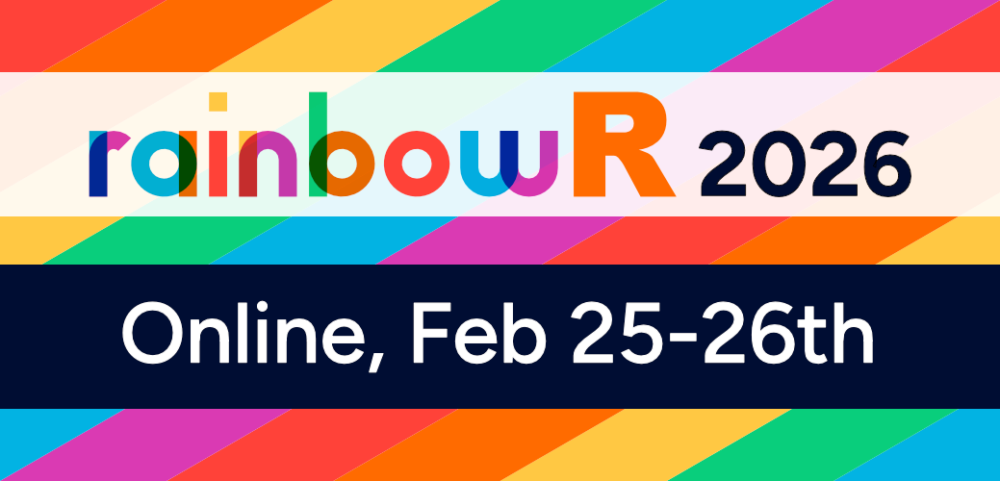
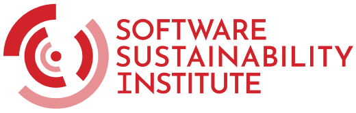
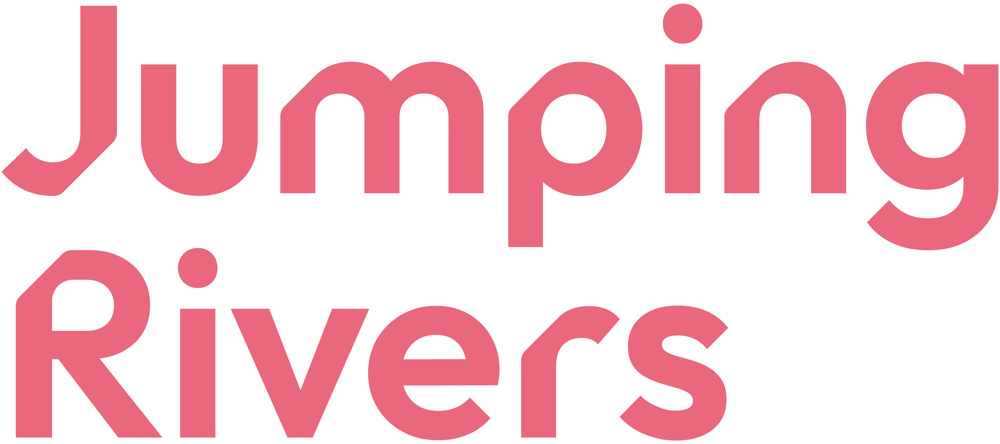

## Welcome
The [rainbowR](https://rainbowr.org) virtual conference will bring together LGBTQ+ users of R, and their allies, to promote their work and foster connections amongst the community.
We have an excellent lineup of LGBTQ+ [speakers](speakers.qmd) across fifteen [talks](talks.qmd)
The conference showcases the diversity of R users as well as the vast possibilities of what you can do in R.
In addition to the talks, we are running virtual [workshops](workshops.qmd) led by experts, as well as virtual [socials](socials.qmd) where conference participants can meet other R users to connect, share experiences, and unwind.

## Who is the conference for?
The conference is for *anyone* interested in R and/or analysing data to understand LGBTQ+ issues.
The majority of speakers and workshop leaders are LGBTQ+, but you do *not* have to be LGBTQ+ to attend.

## About rainbowR
rainbowR is a community whose mission is to connect, support and promote LGBTQ+ R users,
and to spread awareness of LGBTQ+ issues through data-driven activism.

Find out more at [rainbowr.org](https://rainbowr.org).

## Important dates (upcoming)
- **Call for proposals opens:** To be confirmed
- **Proposal deadline:** To be confirmed
- **Registration opens:** To be confirmed
- **Conference:** To be confirmed

## Sponsored and supported by
::: {.callout-note}
Add confirmed sponsors and supporters here. The layout below follows the previous conference site; remove any unused columns
:::

Generously sponsored by the [Software Sustainability Institute](https://software.ac.uk), [Jumping Rivers](https://www.jumpingrivers.com) and [OLS](https://we-are-ols.org).

::: {layout="[[55, -5, 40]]" style="margin-bottom: 2em;"}

:::

::: {layout="[[25, -75]]"}

:::

Add any acknowledgements, donors, or solidarity-payment supporters below this section when they are confirmed.

## Contact

Please contact [hello@rainbowr.org](mailto:hello@rainbowr.org). We'd love to hear from you!