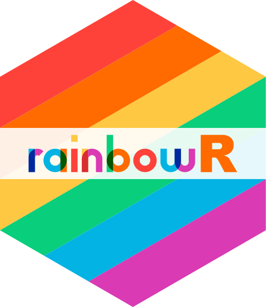

## Welcome to the rainbowR conference

[Conference date and event format]

## A safe and welcoming space for LGBTQ+ folks and allies

[rainbowr.org/code-of-conduct](https://rainbowr.org/code-of-conduct)

::: {.callout-tip}
If you experience or witness anything that makes you uncomfortable, contact
[the Code of Conduct team](mailto:coc@rainbowr.org) or use the reporting route
listed on the conference Code of Conduct page.
:::

## Why a rainbowR conference?

- Centre LGBTQ+ members of the R community
- Learn about R
- Understand LGBTQ+ data
- Make connections
- Have fun

## Schedule

Share the event schedule, including the time zone, breaks, social events, and
where attendees can find the current version online.

## Participation

Explain how to use the event platform, ask questions, take part in chat, and
join the conference Discord. Include a clear recording policy.

## About rainbowR

rainbowR connects, supports, and promotes LGBTQ+ R users, and spreads awareness
of LGBTQ+ issues through data-driven activism.

[rainbowr.org](https://rainbowr.org)

## Thank you

Thank speakers, workshop and social leaders, organisers, sponsors, supporters,
and everyone attending. Add the relevant names and logos once they are confirmed.

## Keep in touch

Add the post-conference next steps, resources, community links, and the date of
the next event when these are available.

<!--
PREVIOUS CONFERENCE REFERENCE (2026)
Copy or adapt this content only after replacing all year-specific details.

---
title: "Welcome to rainbowR 2026!"
footer: <https://conference.rainbowr.org>
title-slide-attributes:
  data-background-image: images/rainbowr-conf-welcome.png
  data-background-size: contain
  data-footer: "false"
  data-notes: |
    - Introduce myself - co-founder and chair of rainbowR
    - Community for LGBTQ+ folks who code in R, founded in 2017 and existed in current form since 2022.
    - Inaugural, excitment, size of conf, 85% new to rainbowR
    - What to expect from the day
    - A little about the community generally
format: 
  rainbowrpres-revealjs:
    progress: false
    slide-number: false
    menu: false
---

## A safe and welcoming space for LGBTQ+ folks and allies

```{=html}
<style>
  #title-slide > h1 {
    display: none;
  }
</style>
```

[rainbowr.org/coc](https://rainbowr.org/coc){.larger200}


::: {.notes}
CoC sets out the community standards and expectations.
However small.
Moderators on Zoom and in Discord, but we might not see everything.
CoC is not punitative
:::

. . . 

::: {.callout-tip}
Let us know if you experience or witness anything that feels uncomfortable.

- [coc@rainbowr.org](mailto:coc@rainbowr.org)
- [reporting form](https://docs.google.com/forms/d/e/1FAIpQLSfOMgx43xj6DuWccAoA5D4Mc1y53EqfpWyOYZkle1z3A-XupQ/viewform)
- message in Discord (see code-of-conduct channel)
:::


## [Why a rainbowR conference?]{.pink} {.inverse .larger150}

[center LGBTQ+ members of the R community]{.red}

[learn about R]{.orange}

[understand LGBTQ+ data]{.yellow}

[make connections]{.green}

[have fun!]{.blue}

::: {.notes}
Tell us in the Zoom chat what you're hoping to get out of the conference
:::

## Schedule

[conference.rainbowr.org/schedule](conference.rainbowr.org/schedule)

| Time (UTC)  | Event                                        |
|-------------|----------------------------------------------|
| 16:15-17:00 | Keynote: Studying queer data while living it |
| 17:00-18:00 | Talks 1                                      |
| 18:00-18:30 | Birds of a feather                           |
| 18:30-19:15 | Lightning talks                              |
| 19:15-20:15 | Talks 2                                      |
| 20:15-20:30 | *break*                                      |
| 20:30-21:30 | Keynote: Claude Code for R *(and close)*     |

::: {.notes}
Talks 1 session will likely be shorter than an hour
:::

## Recordings

::: {columns}
::: {.column .col-box-green width="32%"}
### pre-recorded

All regular and lightning talks
:::

::: {.column .col-box-yellow width="32%"}
### recording live

*Claude Code for R*
:::

::: {.column .col-box-red width="32%"}
### not recorded

*Studying queer data while living it: Positionality, power, and practice*

Workshops

Quiz, social, birds of a feather
:::
:::


::: {.notes}
We want to balance being able to share material from the conference more widely, esp for those unable to join at these times, with creating a safe environment for folks joining live.

Zoom may ask you to agree to be recorded to join a meeting, but rest assured we will not be recording participants
:::

## Zoom chat and Q&A

- Use Q&A feature in Zoom for questions during sessions
- Use Zoom chat for general chat
- Be active!


::: {.notes}
Chat: Say hi, tell us where you're joining from

Q&A: Ask us about rainbowR
:::

## {background-image="images/discord.png" background-size="contain" footer="false"}

::: {.notes}
- invitation link (*put in chat*)
- Onboarding process - say hi in introductions
- for *asynchronous* chat (not during talk sessions)
- start and continue conversations
- will exist beyond conference
:::

# [rainbowR]{.yellow} {.inverse .larger150}

a [community]{.green} that
[connects]{.red}, [supports]{.orange} and [promotes]{.yellow} [LGBTQ+]{.pink} people in the [R community]{.blue} and spreads awareness of [LGBTQ+]{.pink} issues through [data-driven activism]{.green}

## {.inverse .larger200 .center-h .center}

[meet-ups]{.green}

[buddies]{.pink}

[book club]{.orange}

[tidyRainbow]{.red}

::: {.notes}
- meetups in two time-zones: connect, chat mostly about R 
- link to conference buddies, another round closing March 2nd
- LGBTQ+ datasets
- join for LGBTQ+ folks (slack, email, newsletter)
:::

. . .

[rainbowr.org/join]{.yellow .larger150}


## {.center-h .inverse footer="false"}

[rainbowr.org]{.larger250 .yellow}



:::{.notes}
So, if you're LGBTQ+ and want to join a vibrant and supportive community of fellow R enthusiasts, or you're someone interested in promoting LGBTQ+ people and issues in the R community and beyond, please visit our website, rainbowr.org, to get involved. 

If not 4:15, take questions and/or encourage chat
:::


## {background-image="images/lets-begin.svg" background-size="contain" footer="false" .inverse}

::: {.notes}
Hand over to Lea to introduce Daphna
:::

## {background-image="images/almost-done.svg" background-size="contain" footer="false" .inverse}

::: {.notes}
- thank yous
- a little about rainbowR
- how to stay involved
:::

## Committees {footer="false"}

{fig-align="center"}

## Speakers {footer="false"}

{fig-align="center"}

## Workshop and social leaders {footer="false"}

{fig-align="center"}

::: {.notes}
Also, the birds of a feather facilitators
:::

## Sponsors and supporters

::: {.columns}
::: {.column width="35%"}

:::

::: {.column width="30%"}
{width="80%"}
:::

::: {.column width="30%"}
{width="60%"}
:::

:::

## 51 folks who made donations/solitarity payments ❤️

:::{.columns}
::: {.column .smaller75}
- Anastasia Voronkova
- Bastián Olea Herrera
- Cody Ingle
- Colin Longstaff
- Digital Research Academy
- Erin Becker
- Esther Plomp, Software Sustainability Institute / University of Aruba 
- James Kilgour
- James Williamson
- Kalel Cascardi
- Kristin Bott
- Krupamani Kanthaiah
- LMP Consulting, LLC
- Lauren Price, Houston Texas USA
:::

::: {.column .smaller75}
- Libby Heeren
- Logan King
- Luke Morris
- Matt Kerlogue 
- Dr. Matt L. Miller, Oakland University Department of Psychology
- Max Czapanskiy, UCSB
- Mickaël Durand, FNRS, UCLouvain
- Rebecca Killick
- Ryan Timpe
- Ted Laderas
- Tegan Crossman
- the-tave
- We All Count
- *twenty-four supporters who prefer to remain anonymous*
:::

:::

::: {.notes}
Excepted 2 folks to do this. Floored by your support and generosity. Stands the community in good stead for the next year.
:::

## {background-image="images/thank-you.svg" background-size="contain" footer="false" .inverse}

::: {.notes}
Thanks to you all for coming, for your enthusiasm, lively chat and thoughtful questions. We hope you'll stay engaged with the rainbowR community...
:::


# [rainbowR]{.yellow} {.inverse .larger150}

a [community]{.green} that
[connects]{.red}, [supports]{.orange} and [promotes]{.yellow} [LGBTQ+]{.pink} people in the [R community]{.blue} and spreads awareness of [LGBTQ+]{.pink} issues through [data-driven activism]{.green}

## {.center-h .inverse footer="false"}

[conference.rainbowr.org/after]{.larger250 .yellow}


:::{.notes}
So, if you're LGBTQ+ and want to join a vibrant and supportive community of fellow R enthusiasts, or you're someone interested in promoting LGBTQ+ people and issues in the R community and beyond, please visit the after page for next steps, e.g. how to stay connected, how to join the community, and future activities. We look forward to seeing you soon!

That's a wrap!
:::
-->
