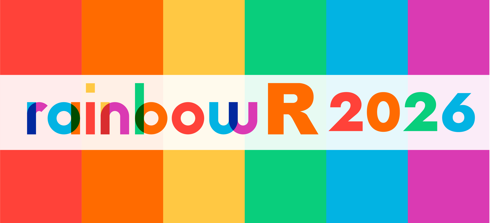

:::{.callout-note}
The programme is being assembled. The examples below preserve the display pattern used for previous rainbowR conferences; replace them with confirmed content when ready.
:::

## Keynotes

### Talk title {#talk-slug}

[**Speaker name**](speakers.qmd#speaker-name)

{fig-alt="RainbowR placeholder graphic"}

**Abstract:**

Add the keynote abstract here.

## Regular talks

Regular talks will run in sessions. Use the sections below to share abstracts and, after the conference, recordings, slides, and other resources.

### Session I {#session-1}

::: {.callout-note collapse="false" icon=false appearance="simple"}
### *Talk title* [**Speaker name**](speakers.qmd#another-speaker) {#another-talk-slug}

**Abstract:**

Add the talk abstract here. Once the event has taken place, add any recording, slides, repository, preprint, or other resources as appropriate.

<!-- Add resource buttons only when the real links are available.
[ Talk recording](https://youtu.be/VIDEO_ID){.btn .icon-link}
[ Slides](slides/speaker-name.pdf){.btn .icon-link}
[ Repository](https://github.com/ORGANISATION/REPOSITORY){.btn .icon-link}
-->

:::

### Session II {#session-2}

Add confirmed talks here using the same callout pattern. Rotate the callout type (`note`, `tip`, `caution`, `warning`, `important`) to retain the colourful programme styling.

## Lightning talks

Use this section for brief presentations and their resources.

::: {.callout-tip collapse="false" icon=false appearance="simple"}
### *Lightning talk title* [**Speaker name**](speakers.qmd#speaker-name) {#lightning-talk-slug}

Add a short abstract if available, then add event resources when they are ready.
:::

<!--
TALK ENTRY CHECKLIST
- Give every talk a lowercase, hyphenated anchor: {#talk-slug}
- Link every speaker name to their matching anchor on speakers.qmd
- Remove resource buttons until real links exist
- Keep external resources in the same button style for a consistent programme
-->

<!--
PREVIOUS CONFERENCE REFERENCE (2026)

---
title: "Talks"
format: html
toc: true
---

## Keynotes

We are happy to welcome **Daphna Harel** and **Hadley Wickham** as our keynote speakers!

### Studying queer data while living it: Positionality, power, and practice
[**Daphna Harel**](speakers.qmd#daphna-harel)

**Abstract:**
What does it mean to study queer data while also living the identities those data attempt to capture? In this talk, I reflect on the opportunities and tensions that arise when queer researchers work with data about queer lives. I explore three interconnected themes. First, positionality: who I am in relation to the data, and how my identity shapes what I see. Second, data as power: who gets counted, categorized, funded, and believed. Finally, practice: how these realities shape what we actually do as researchers. I discuss general practice as a quantitative researcher and explore these themes through a case study drawn from my own experiences designing and analyzing measures of sexual orientation and gender identity (SOGI) in survey research.

### Claude Code for R
[**Hadley Wickham**](speakers.qmd#hadley-wickham)

**Abstract:**
If you've been paying attention to software engineering social media lately, you might have noticed a lot of noise about Claude Code and the Opus 4.5 model. For me personally, these have pushed AI coding assistance from a "nice to have" to something that feels just as important as git.

In this talk, I'll show you a couple of my "vibe" coded experiments, but more importantly show you how Claude Code helps me write higher-quality R code faster. I've used it a bunch recently for both testthat and dbplyr, two large, well-established code bases where quality is more important than velocity.

[ Talk recording](https://youtu.be/dOEUdhHHfJY){.btn .icon-link}

## Regular talks

20-minute talks will run in two sessions.
Open the sections below to read the talk abstracts and access recordings, slides, and other resources.

### Talks Session I{#talks_1}

::: {.callout-note collapse="false" icon=false appearance="simple"}
### *Intersectionality in LGBTQ+ health research: Practical analysis in R using upset plots* [**Chris Battiston**](speakers.qmd#chris-battiston)

**Abstract:**
Intersectionality plays a critical role in understanding LGBTQ+ health, yet most analytic workflows still treat identities like gender, orientation, race, and socioeconomic status as isolated variables. This talk focuses on a practical approach for exploring overlapping identities in clinical and community health datasets using R. I’ll demonstrate how to prepare intersectional data structures, generate membership indicators, and apply UpSet Plots to visualize complex combinations that traditional summaries or Venn diagrams can’t capture. The session highlights how these methods surface disparities in participation, missingness, lab values, and patient-reported outcomes that are often invisible in standard analysis. By grounding the discussion in real analytic challenges, the talk shows how intersectional R workflows support more accurate, inclusive, and ethically responsible health research. Participants will leave with reproducible code examples, practical visualization techniques, and a clear path to integrating intersectional analysis into their own work.

[ Talk recording](https://youtu.be/YxkrxyEaFPs){.btn .icon-link}
[ GitHub repository](https://github.com/darthpathos76/rainbowR/tree/main){.btn .icon-link}
[ Slides](slides/ChrisBattison_rainbowR2026.pptx){.btn .icon-link}
:::

-->